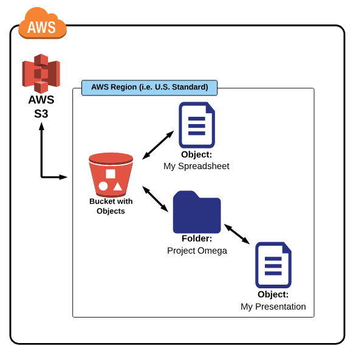

# AWS-Learning

Estudo da AWS

# Aws CLI

# Udemy AWS

Link do Curso: [AWS Essentials](https://www.udemy.com/aws-essentials)

Site de Suporte: [Projeto Omega](https://www.lucidchart.com/documents/view/703f6119-4838-4bbb-bc7e-be2fb75e89e5/0) 

## S3 (Simple Storange Service)

S3 (Simple Storange Service) é um storange com acesso a dado de alta escalabilidade, rápido, infraestrutura de armazenamento barato. Espaço para armazenamento praticamente ilimitado.

Ao criar um S3 é criado um *folder root* chamado  *Bucket* , subfolders criados dentro do bucket são considerados como folders.

Os Buckets são criados em regiões específicas, como boa práticas sleecione a região fisica mais próxima para reduzir a latência ou em uma região perto do seu consumidor.

O Free Tier fornece 5GB, 20000 Get Request e 2000 Put Request e e 15GB de tranferência de dados para cada mes por um ano. Caso seja necessário comprar mais recurso acesse o link abaixo.

[Price S3 Bucket](https://aws.amazon.com/s3/pricing/)

## Navegando no Bucket S3

Nomeclatura dos Buckets segue um padrão
+ O nome do Bucket deve ser único por toda AWS;
+ O nome tem que ter entre 3 a 63 carácteres;
+ Os nomes só podem conter letras minúsculas, números e hífens;
+ Não pode ter um nome similar a endereço de ip ex.: 198.175.5.4.

## S3 Storage Classes 

### Standard:
+ Storage para todos propósitos;
+ É o tipo padrão;
+ Durabilidade de 11 noves, 99,999999999%;
+ 99,99% disponibilidade do objeto;
+ É a classe de storage mais cara;
  
### Reduced Redundancy Storage (RRS)
+ Desenhado para não critico, reprodução de objetos;
+ 99,99% de durabilidade;
+ 99,99% de disponibilidade;
+ Mais barato que a standard class;

### Infrequent Access (S3-IA)
+ Desenhado para objetos que são pouco acessados, mas estão disponíveis imediatamente;
+ 99,999999999% de durabilidade;
+ 99,90% de disponibilidade;
+ É menos caro que o o standard/RRS class

### Glacier
+ Desenhado para armazenamento de arquivos por muito tempo;
+ Pode demroar várias horas para armazenar objetos no Glacier para ser retornado(horas para retorno);
+ 99,999999999% de durabilidade;
+ É o mais barato S3 storage class( very low cost)

### Object Durability
 
Porcentagem de um arquivo armazenado na S3 de não ser perdido. Por exemplo durabilidade de 99.99999999999% significa que há 0,00000000001% de chances de um arquivo ser perdido em um ano na S3

Se existe 10.0000 arquivos armazenados na S3(11 nine) é esperado que um arquivo seja perdido após 10 milhões de anos

### Object Availability

Porcentagem de um periodo de um ano o arquivo está livre para acesso na S3

Para um disponibilidade de 99,99% isso significa que 0.01% de chance que você não seja capaz de acessar o arquivo na S3 em um ano.

Para cada 10.000 hora, você pode esperar que um total de um ano para cada arquivo possa não ser acessado

## Lifecycle

É possível determinar o ciclo de vida de um arquivo no S3, de acordo com a regra é possivel determinar quanto tempo ele fica no Bucket como standard, glacier,Infrequent Access e outros.